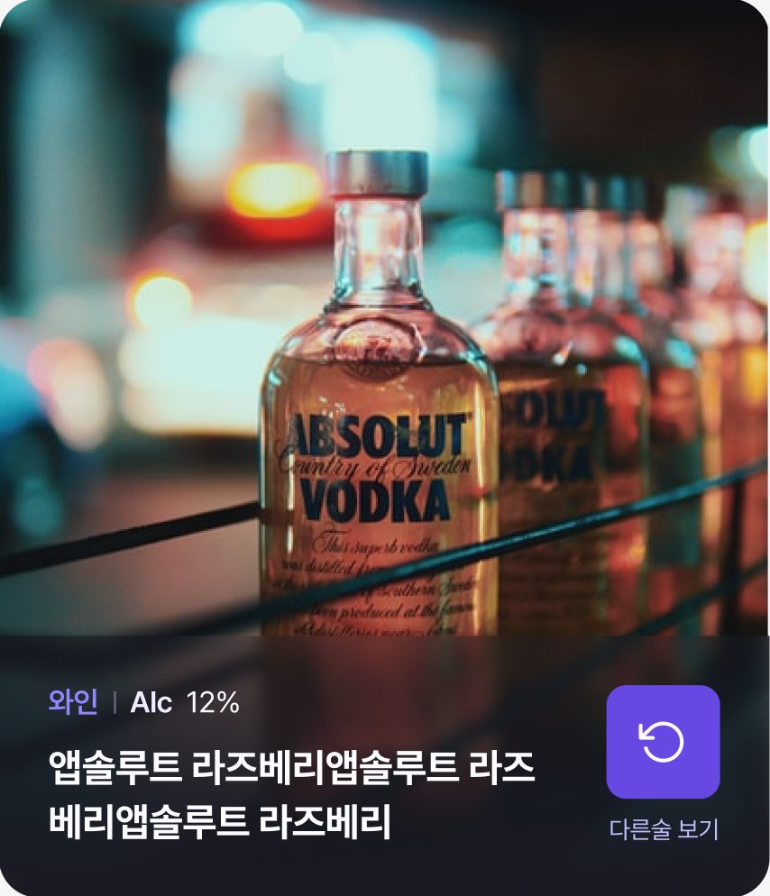
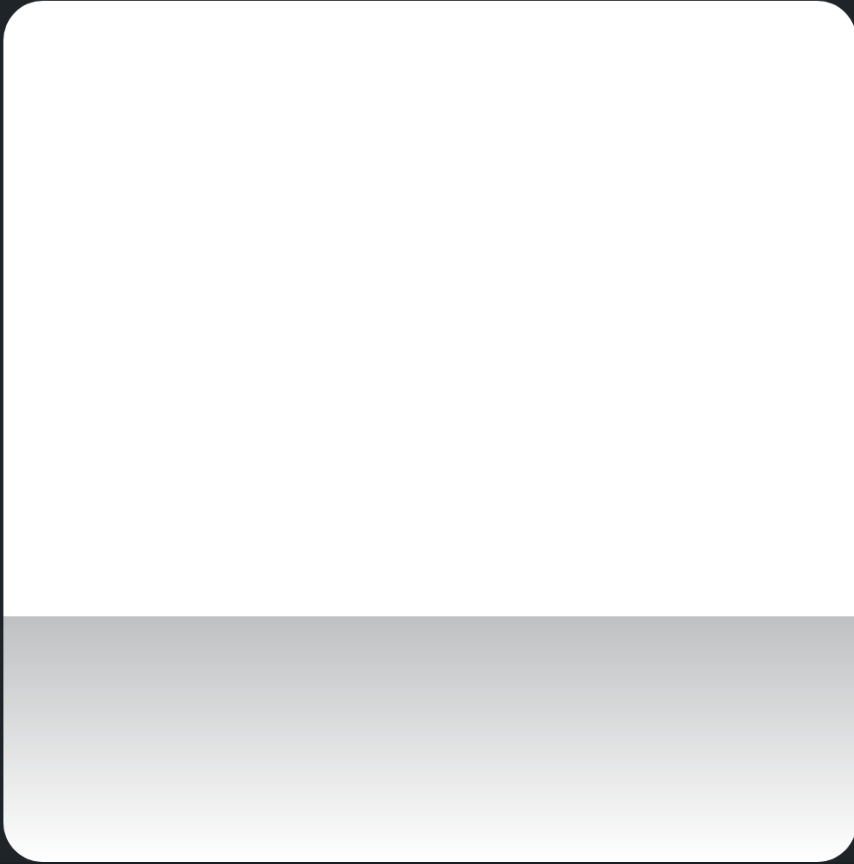
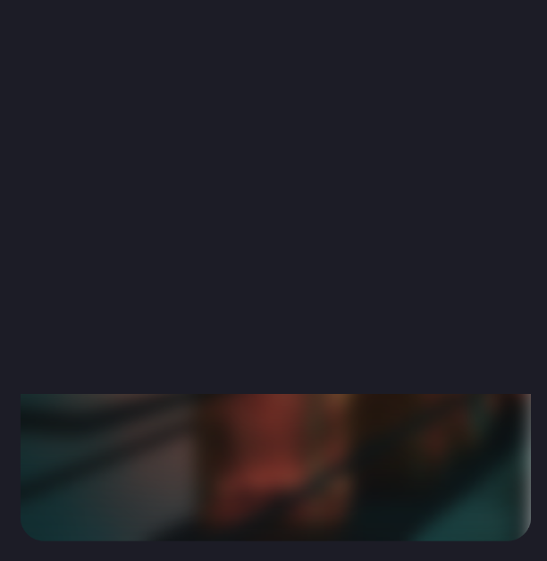
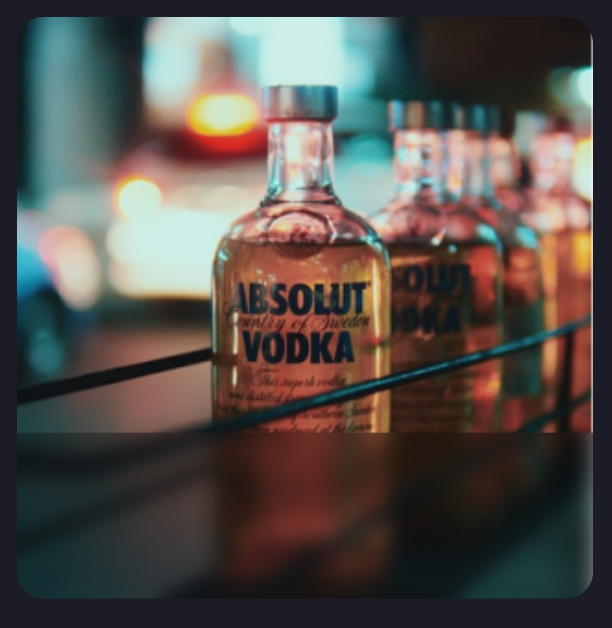
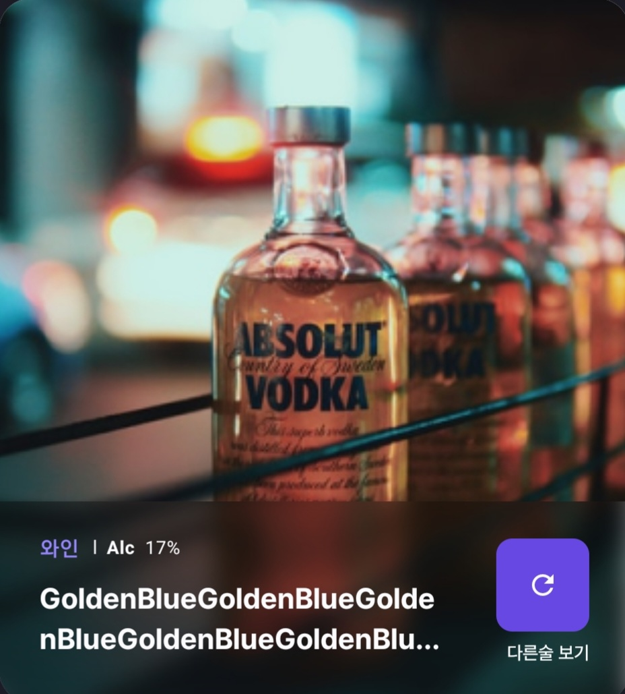

안녕하세요. 안드로이드 12기 김현국입니다.
프로젝트를 진행하면서, 이미지를 흐리게 처리해야 하는 부분이 생겨서 jetpack compose를 이용하면서 이미지를 blur 처리하는 방법을 공유하면 좋을 것 같아서, 이미지 블러 처리에 대한 글을 작성하게 되었습니다~!.

제가 최종적으로 만들려고 하는 카드는 다음과 같습니다. 하단에 이미지가 blur 처리되어 있는데요. 이것을 compose로 구현하기 위해서는 어떻게 구현을 해야 하는지 알아보도록 하겠습니다.



API 31 이전까지는 Render Script를 사용하여 Blur 처리를 할 수 있었습니다.

```kotlin
val bitmap = BitmapFactory.decodeResource(
    LocalContext.current.resources,
    R.drawable.your_image
)
val rs = RenderScript.create(LocalContext.current)
val bitmapAlloc = Allocation.createFromBitmap(rs, bitmap)
ScriptIntrinsicBlur.create(rs, bitmapAlloc.element).apply {
    setRadius(BLUR_RADIUS)
    setInput(bitmapAlloc)
    forEach(bitmapAlloc)
}
bitmapAlloc.copyTo(bitmap)
rs.destroy()
```
하지만 Render Script API는 Android 12부터 지원을 중단하기 때문에 12버전에서는 다른 방법으로 blur 처리를 해주어야 합니다.

그 방법은 Modifier의 blur를 사용하는 것입니다.
```kotlin
fun Modifier.blur(
    radiusX: Dp,
    radiusY: Dp,
    edgeTreatment: BlurredEdgeTreatment = BlurredEdgeTreatment.Rectangle
): Modifier

// radius : x , y 축을 따른 blur의 반경
// edgeTreatment : 원래 입력 범위를 벗어나는 픽셀을 랜더링하는데 사용되는전략
```
Android 12버전 이상에서만 적용할 수 있기 때문에 이 기능은 12 이전의 버전에서는 사용해도 무시가 됩니다.

위의 수정자를 이용해서 구현을 해보려고 합니다.

이미지를 한번에 전체에서 일부만 blur 처리를 하는 방법은 어려울 것 같아서 blur 처리된 이미지와 원본 이미지를 겹치는 방법을 사용해보도록 하겠습니다.

그럼 컴포저블을 만들어보겠습니다

```kotlin
@Composable
fun BlurImage(content: @Composable () -> Unit) {
    Box {
        content()
        // 여기서 블러 처리
    }
} 
```

content 컴포저블 람다를 이용해서 Image 컴포저블을 매개변수로 받으려고합니다.

```kotlin
// 블러처리에 대한 코드 
Box(
      modifier = Modifier
           .fillMaxWidth()
           .fillMaxHeight()
           .drawWithContent { //ContentDrawScope
               clipRect(top = size.height / 1.4f) { // DrawScope
					// val colors = listOf(Color.Transparent, Color.White)
                   this@drawWithContent.drawContent()
					//drawRect(
					//		brush = Brush.verticalGradient(colors),
					//		blendMode = BlendMode.DstIn 겹치는 부분에만 보이게
               }
            }
            .blur(
                radiusX = 10.dp, radiusY = 10.dp
            )
) {
    content()
}
```

그다음 블러 처리를 해줄 Box layout을 만들어줍니다.

여기서 drawWithContent를 사용해서 Draw Modifier를 생성합니다.

그다음 clip Rect를 사용해서 그리기 연산이 일어나는 영역을 설정합니다. 예시의 blur는 상단으로부터 많이 떨어져 있으니까, 상단으로부터 적절한 수치로 잘라주었습니다.

전체 높이에서 상단으로부터 size.height/1.4f 만큼을 잘라주고 나머지에 대한 부분에 blur처리를 한다고 보시면 되시겠습니다. 

drawRect는 선택사항인데요, gradient를 줌으로써 blur와 이미지의 경계를 조금 더 구분 짓고 싶다? 라고 생각하신다면 추가하시면 됩니다.



이렇게 gradient가 들어가게 되면서, 경계가 좀 더 명확해집니다.
마지막으로 Box Scope 내부에 content를 집어줍니다.
Box 안에 content만 넣은 결과는 다음과 같습니다.



최종적으로 blur 처리한 이미지와 원본 이미지를 합치게 된다면 다음의 이미지를 얻을 수 있습니다.



BlurImage 컴포저블의 최종코드입니다. 

```kotlin
@Composable
fun BlurImage(content: @Composable () -> Unit) {
    Box {
        content()
        Box(
            modifier = Modifier
                .fillMaxWidth()
                .fillMaxHeight()
                .drawWithContent {
                    clipRect(top = size.height / 1.4f) {
                      //  val colors = listOf(Color.Transparent, Color.White)
                        this@drawWithContent.drawContent()
                     //   drawRect(
                      //      brush = Brush.verticalGradient(colors),
                      //      blendMode = BlendMode.DstIn
                        )
                    }
                }
                .blur(
                    radiusX = 10.dp, radiusY = 10.dp
                )
        ) {
            content()
        }
    }
}
// 호출부분
Box{
	BlurImage{
		 AsyncImage( //coil or imageComposable
			modifier = Modifier.fillMaxWidth().fillMaxHeight(),
			model = ImageRequest.Builder(LocalContext.current).data(url).build(),
			contentDescription = null,
			contentScale = ContentScale.Crop // blur가 짤린다면 넣어보세요
	}
}

```
이제 하단의 와인에 대한 설명을 만들어보겠습니다.

저는 저 블러의 크기에 딱 맞는 Box layout을 만들고자 했습니다.

그 이유는 블러 영역과 같게 height를 적용해서 내부 아이템의 Arrangement를 블러 영역 안에서 지정해주기 위함입니다.


```kotlin
var rowheight by remember {
        mutableStateOf<Dp?>(null)
}
Box(
       modifier = Modifier
           .fillMaxWidth()
           .fillMaxHeight()
           .drawWithContent {
               clipRect(top = size.height / 1.4f) {
                  rowheight = (size.height - size.height / 1.4f).toDp()
                  this@drawWithContent.drawContent()
              }
          }
) {
		rowheight?.let{
			Row(
				modifier = Modifier
						.fillMaxWidth()
						.height(it)
						.align(Alignment.BottomCenter) // 필수
			){ 
				// RowScope
				//row 구현 ~
					
			}
		}
}
```

size. height로부터 clip 된 영역을 빼서 row의 height를 구했습니다.

위에서 blur 이미지 영역을 구한 것처럼 같은 크기로 clip을 해주고,

row height를 구해서 Row에 height를 지정해주었습니다.

Bottom Center align을 적용함으로써 clip 되지 않은 영역에 Row 컴포저블이 보이도록 하였습니다.

이제 row Scope 내부에서 입맛대로 구현하시면 됩니다.

```kotlin
@Composable
fun RecommendWineCard(
    modifier: Modifier,
    recommendWine: Wine // data 
) {
    var rowheight by remember {
        mutableStateOf<Dp?>(null)
    }
    Box(modifier = modifier) {
        BlurImage {
            AsyncImage(
                modifier = Modifier.fillMaxWidth().fillMaxHeight(),
                model = ImageRequest.Builder(LocalContext.current).data(recommendWine.imageUrl).build(),
                contentDescription = null,
                contentScale = ContentScale.Crop
            )
        }
        Box(
            modifier = Modifier
                .fillMaxWidth()
                .fillMaxHeight()
                .drawWithContent {
                    clipRect(top = size.height / 1.4f) {
                        rowheight = (size.height - size.height / 1.4f).toDp()
                        this@drawWithContent.drawContent()
                    }
                }
        ) {
            rowheight?.let {
                Row(
                    modifier = Modifier
                        .fillMaxWidth()
                        .height(it)
                        .align(Alignment.BottomCenter)
                        .padding(start = 20.dp, end = 20.dp),
                    horizontalArrangement = Arrangement.SpaceBetween,
                    verticalAlignment = Alignment.CenterVertically

                ) {
									// row 구현~
						}

					}
			}
}
```


* * *
위의 방법은 안드로이드 12버전을 위한 방법이었습니다. 그렇다면 12버전 이전의 버전이라면 어떻게 구현을 해야 할까요? Render Script를 사용해도 되지만,

>Android 플랫폼에서 Render Script가 지원 중단됨에 따라 Android Gradle 플러그인에서도 Render Script 지원을 삭제합니다. Android Gradle 플러그인 7.2부터 Render Script API는 지원 중단됩니다. 계속 작동하지만, 경고가 호출되고 향후 AGP 버전에서 완전히 삭제됩니다

라는 문구를 보게 되었기 때문에, Render Script는 사용하지 않는 게 좋을 것 같습니다.

하지만 대체 라이브러리인 Render Script Intrinsics Replacement Toolkit이란 것을 지원하는 것을 알게 되었습니다.
[RenderScript Intrinsics Replacement Toolkit](https://github.com/android/renderscript-intrinsics-replacement-toolkit)

일단 처음이 repository를 보고서 적용하기가 힘들다는 생각이 들었습니다. 어떻게 적용을 해야 하는지, 파악이 힘들었습니다.

그래서 누군가 저와 같은 고민을 하고 있을 것이란 생각으로 이슈에 들어가니 jitpack으로 사용할 수 있도록 되어있어서 호다닥 가져오게 되었습니다.
[Toolkit Jitpack](https://jitpack.io/#android/renderscript-intrinsics-replacement-toolkit/b6363490c3)


구현하는 방식은 위에서 구현했던 방식과 같은데요. blur 처리하는 부분을 바꾸어주어야 합니다.

```kotlin
@Composable
fun RenderBlurImage(content: @Composable () -> Unit, blurImage: @Composable () -> Unit) {
    Box {
        content()
        Box(
            modifier = Modifier
                .fillMaxWidth()
                .fillMaxHeight()
                .drawWithContent {
                    clipRect(top = size.height / 1.4f) {
                        val colors = listOf(Color.Transparent, Color.White)
                        this@drawWithContent.drawContent()
                        drawRect(
                            brush = Brush.verticalGradient(colors),
                            blendMode = BlendMode.DstIn
                        )
                    }
                }
        ) {
            blurImage()
        }
    }
}
```

blur 처리되는 이미지와 원본 이미지를 매개변수로 받아주었습니다.

Toolkit을 사용하기 위해서는 이미지를 bitmap으로 받아야 합니다.

```kotlin
// In ViewModel
private val _bitmap: MutableStateFlow<Bitmap?> = MutableStateFlow(null)
    val bitmap = _bitmap.asStateFlow()

fun transBitmap(context: Context, url: String) {
        val loading = ImageLoader(context)
        val request = ImageRequest.Builder(context)
            .data(url).build()

        viewModelScope.launch {
            _bitmap.value = (
                (
                    ((loading.execute(request) as SuccessResult).drawable)
                        as BitmapDrawable
                    ).bitmap
                ).copy(Bitmap.Config.ARGB_8888, true)
                .let {
                    Toolkit.blur(it, 10)
                }
        }
    }

```

viewModel에서 coil의 이미지 로더를 이용해서 bitmap으로 가져왔습니다. 여기서 중요한 것은 Toolkit.blur를 사용하기 위해서는 Bitmap을 ARGB_8888으로 사용해야 합니다.

저는 coil 라이브러리를 통해 이미지를 url로 불러오기 때문에 위와 같은 방법으로 bitmap을 가져왔지만, url로 불러오지 않고 drawable의 이미지를 사용하시는 경우

drawable을 bitmap으로 변환하고, Toolkit을 적용하시면 됩니다.

```kotlin
//In Screen Compoasble
val blurBitmap = homeViewModel.bitmap.collectAsState().value

if (blurBitmap != null) {
		RecommendWineCard(
            modifier = Modifier
                  .fillMaxWidth()
                  .height(367.dp)
                  .padding(start = 24.dp, end = 24.dp, top = 19.dp)
                  .clip(RoundedCornerShape(16.dp)), // 카드의 modifier는 자유롭게 ~!
                  recommendWine = //wine data,
                  blurImage = blurBitmap,
    )
}

```

```kotlin
@Composable
fun RecommendWineCard(
	modifier : Modifier,
	recommendWine : Wine
){
	var rowheight by remember {
        mutableStateOf<Dp?>(null)
    }
    Box(modifier = modifier) {
        RenderBlurImage(
            content = {
                AsyncImage(
                    modifier = Modifier
                        .fillMaxWidth()
                        .fillMaxHeight(),
                    model = ImageRequest.Builder(LocalContext.current)
                        .data(recommendWine.imageUrl)
                        .build(),
                    contentDescription = null,
                    contentScale = ContentScale.Crop
                )
            }, blurImage = {
                Image(
                    modifier = Modifier.fillMaxHeight().fillMaxWidth(),
                    bitmap = blurImage.asImageBitmap(),
                    contentScale = ContentScale.Crop,
                    contentDescription = null
                )
            }
        )
		Box(
            modifier = Modifier
                .fillMaxWidth()
                .fillMaxHeight()
                .drawWithContent {
                    clipRect(top = size.height / 1.4f) {
                        rowheight = (size.height - size.height / 1.4f).toDp()
                        this@drawWithContent.drawContent()
                    }
                }
        ) {
            rowheight?.let {
                Row(){
					  //row ~
					}
				}
			}
	}
}
```

위와 같이 구현한다면 blur처리를 12버전 이전에서도 사용할 수 있습니다!!

### 마치면서

처음에는 막상 어렵게만 느껴져서, 만들 수 없을 것 같다라는 생각도 했었지만 구현을 도전해보니 저에게 많은 공부가 될 수 있었습니다.

저와 같이 블러 처리된 카드를 만들고 싶은 개발자분들께 많은 도움이 되었으면 좋겠습니다.


***
### 참고 링크 
[get bitmap from coil](https://www.youtube.com/watch?v=xoOecJZ2Q-0)

[RenderScript에서 이전하기](https://developer.android.com/guide/topics/renderscript/migrate#scripts)

[bitmap ARGB8888로 받기](https://stackoverflow.com/questions/25576869/how-to-set-bitmap-to-argb-8888-in-android)

[composable 자르기](https://stackoverflow.com/questions/71904066/jetpack-compose-cut-composable-in-half)

[mirror effect in compose](https://proandroiddev.com/mirror-effect-with-jetpack-compose-78db11b5c30b)

[blur in jetpack compose](https://stackoverflow.com/questions/65998819/blur-in-jetpack-compose)

[RenderScript Intrinsics Replacement Toolkit](https://github.com/android/renderscript-intrinsics-replacement-toolkit)

[Toolkit Jitpack](https://jitpack.io/#android/renderscript-intrinsics-replacement-toolkit/b6363490c3)